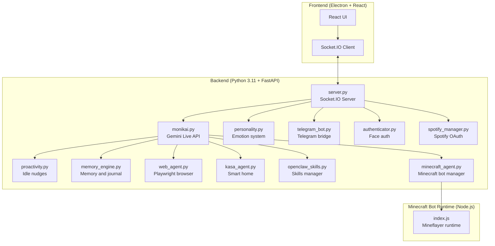

# MonikAI


MonikAI is a local-first AI companion for desktop use. It can talk in real time, remember things locally, see your screen and camera when enabled, and connect to tools like Telegram, Spotify, Minecraft, web browsing, and smart home devices.

## What It Does

| Area | What it does | Main tech |
|------|--------------|-----------|
| Voice conversation | Real-time voice chat with interruption handling and native audio output | Gemini Live API |
| Screen and camera understanding | Reads screen content, webcam frames, OCR text, and study-page captures | `mss`, OpenCV, PaddleOCR |
| Memory | Stores notes, journal pages, reminders, and structured memory across sessions | Local JSON and Markdown storage |
| Personality | Keeps mood, affection, energy, quests, unlocks, and tone state persistent | Stateful persona model |
| Proactivity | Runs conservative background thinking and nudges | Idle timers and heuristics |
| Telegram bridge | Supports text, images, voice notes, and memory helpers | Telegram Bot API |
| Web agent | Browses, clicks, searches, and completes longer web tasks | Playwright + Chromium |
| Spotify | Connects to Spotify and reads now playing, playlists, and recent listening | Spotify Web API |
| Smart home | Controls supported TP-Link Kasa devices | `python-kasa` |
| Face auth | Can stay locked until your face is recognized locally | MediaPipe Face Landmarker |
| Minecraft agent | Connects to your Minecraft server and performs in-game actions | Mineflayer bot runtime |

## Quick Start

```bash
git clone https://github.com/aerokero/monikai.git
cd monikai

conda create -n monikai python=3.11 -y
conda activate monikai
pip install -r requirements.txt
playwright install chromium

npm install
echo "GEMINI_API_KEY=your_key_here" > .env

npm run dev
```

## Project Layout

- `backend/core/` - runtime, socket handlers, lifecycle, and HTTP routers
- `backend/ai/` - memory, personality, quests, progression, and related systems
- `backend/agents/` - integrations for Telegram, Spotify, smart home, and web tasks
- `backend/integrations/games/minecraft-bot/` - the Node.js Minecraft bot runtime
- `backend/integrations/media/authenticator.py` - face authentication
- `backend/tools/openclaw_skills.py` - skills manager and tooling helpers
- `src/` - React UI
- `data/` - local settings, memory, profiles, sessions, quests, and recaps

## Setup And Docs

| What you want | Where to go |
|--------------|-------------|
| System setup and requirements | [Installation Guide](https://github.com/aerokero/monikai/wiki/Installation-Guide) |
| Environment variables | [Environment Variables](https://github.com/aerokero/monikai/wiki/Environment-Variables) |
| Face auth, permissions, proactivity | [Configuration](https://github.com/aerokero/monikai/wiki/Configuration) |
| Spotify, Minecraft, Telegram, smart home setup | [Feature Setup](https://github.com/aerokero/monikai/wiki/Feature-Setup) |
| Troubleshooting | [Troubleshooting Guide](https://github.com/aerokero/monikai/wiki/Troubleshooting) |
| Development notes | [Development Guide](https://github.com/aerokero/monikai/wiki/Development) |
| API reference | [API Reference](https://github.com/aerokero/monikai/wiki/API-Reference) |
| Contributing | [Contributing](https://github.com/aerokero/monikai/wiki/Contributing) |

## Architecture



## Privacy

Most user state lives locally in `data/` on your machine, including profile data, personality state, conversations, reminders, journal entries, and OAuth tokens. There is no custom cloud backend for memory or personality state.

## License

MIT. See [LICENSE](LICENSE).
