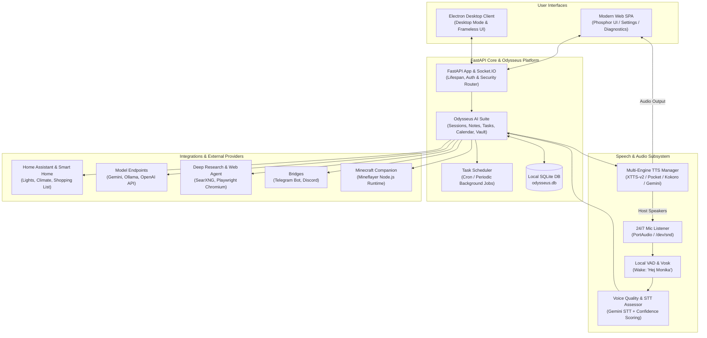

# MonikAI


**MonikAI** is a local-first, multi-modal AI companion, smart home hub, and autonomous personal workspace. Built around an asynchronous FastAPI core seamlessly unified with the **Odysseus AI platform**, MonikAI delivers 24/7 always-on voice conversations, local wake-word detection, multi-engine neural speech synthesis (XTTS-v2, Pocket TTS, Kokoro), native Home Assistant smart home control, and persistent SQLite-backed memory.

---

## Key Capabilities

| Capability | Description | Tech Stack |
| :--- | :--- | :--- |
| **Always-On Server Voice** | Continuous 24/7 background room listening, local VAD, wake-word recognition, acoustic chime acknowledgment, and trailing-silence detection. | Vosk, PyAudio / sounddevice, Gemini STT |
| **Voice Quality & Intelligibility** | Real-time confidence scoring, hallucination mitigation, and verification of speech intelligibility before triggering agent actions. | Voice Quality Assessor, Custom Confidence Heuristics |
| **Multi-Engine Speech Synthesis** | High-fidelity vocal replies with support for voice cloning, speed/volume control, and automated reasoning-tag (`<thought>`) filtering. | Coqui XTTS-v2 (CUDA), Kyutai Pocket TTS, Kokoro-82M (Polish G2P), Gemini Cloud TTS, espeak-ng |
| **Odysseus AI Workspace** | Comprehensive personal workspace managing chat sessions, notes, calendar, tasks, contacts, document RAG, and encrypted vault storage. | Native Odysseus AI Backend, SQLite / SQLAlchemy, CalDAV, CardDAV |
| **Multi-Model Orchestration** | Flexible model selection and runtime discovery across cloud and local inference providers without restarting the server. | Google Gemini (Flash / Pro / Live), Local Ollama, OpenAI-compatible APIs |
| **Home Assistant & IoT** | Direct control of lights, switches, climate, shopping lists, and scenes with tool-approval safety guards and ambient light feedback. | Home Assistant REST/WebSocket API, Philips Hue, TP-Link Kasa |
| **Autonomous Agents & Tools** | Background tasks, deep web research, web browser automation, and MCP (Model Context Protocol) tool execution with approval flows. | Playwright + Chromium, Deep Research Agent, Croniter Scheduler, MCP |
| **Messaging Bridges** | Synchronized conversation access and memory helpers across messaging platforms with voice-note and image support. | Telegram Bot API, Discord.py |
| **Gaming Companion** | Autonomous Minecraft companion bot with visual perception, spatial memory, and in-game task execution. | Mineflayer (Node.js runtime), Custom Bridge |
| **Computer Vision & Auth** | Screen capture understanding, document OCR, and local biometric face locking/unlocking. | PaddleOCR, MediaPipe Face Landmarker, OpenCV, `mss` |

---

## Architecture Overview



---

## Deployment & Setup

MonikAI supports deployment as a containerized server stack (recommended for continuous home use) or as a local development / desktop environment.

### Option 1: Docker Compose (Recommended)

The Docker Compose configuration includes the MonikAI application, the GPU-accelerated Coqui XTTS-v2 speech synthesis server, and Watchtower for automated rolling updates.

#### 1. Requirements
- Docker Engine & Docker Compose v2+
- NVIDIA GPU with [NVIDIA Container Toolkit](https://docs.nvidia.com/datacenter/cloud-native/container-toolkit/latest/install-guide.html) (for XTTS-v2 and Kokoro acceleration)
- Host audio access (`/dev/snd`) for direct server microphone and speaker operation

#### 2. Configuration (`.env`)
Create a `.env` file in the root directory:

```env
# Core API Keys & Endpoints
GEMINI_API_KEY=your_gemini_api_key_here
MONIKAI_HOST=0.0.0.0
MONIKAI_PORT=8000

# Always-On Server Microphone
SERVER_MIC_LISTENER_ENABLED=true
SERVER_MIC_WAKE_WORD_REQUIRED=true
SERVER_MIC_VOSK_MODEL_PATH=/app/data/vosk-model
SERVER_MIC_TTS_PROVIDER=xtts
SERVER_MIC_TTS_LANGUAGE=pl
SERVER_MIC_STT_MIN_CONFIDENCE=0.60
SERVER_MIC_TRAILING_SILENCE_MS=1200
SERVER_MIC_MAX_SPEECH_MS=15000

# Text-to-Speech (XTTS-v2 microservice)
XTTS_SERVER_URL=http://192.168.1.10:8020
XTTS_DEFAULT_SPEAKER=leda

# Smart Home Integration
HOME_ASSISTANT_URL=http://homeassistant.local:8123
HOME_ASSISTANT_TOKEN=your_long_lived_access_token

# Optional Integrations
TELEGRAM_BOT_TOKEN=your_telegram_bot_token
DISCORD_BOT_TOKEN=your_discord_bot_token
SPOTIPY_CLIENT_ID=your_spotify_client_id
SPOTIPY_CLIENT_SECRET=your_spotify_client_secret
SPOTIPY_REDIRECT_URI=http://localhost:8000/callback
```

#### 3. Prepare Local Assets
Place a compatible Polish Vosk speech model inside `data/vosk-model`:
```bash
mkdir -p data/vosk-model
# Extract your chosen Vosk model (e.g. vosk-model-small-pl-0.22) into data/vosk-model
```

#### 4. Launch Containers
```bash
docker compose up -d
```
Access the web workspace at `http://<your-server-ip>:8000`.

---

### Option 2: Local Development & Desktop Client

#### 1. Prerequisites
- Python 3.11+
- Node.js 20+ & npm
- FFmpeg, PortAudio, and espeak-ng installed on your host system

#### 2. Environment Setup
```bash
# Clone the repository
git clone https://github.com/aerokero/monikai.git
cd monikai

# Python Virtual Environment
python3 -m venv .venv
source .venv/bin/activate
pip install -r requirements.txt
python -m playwright install chromium

# Frontend Dependencies
npm install
```

#### 3. Run Development Server
```bash
# Launch FastAPI backend and Vite development server with Electron
npm run dev

# Or launch only the backend server
python -m backend.core.server
```

---

## Speech & Audio Architecture

### Always-On Server Microphone Listener
MonikAI can listen continuously to ambient room sound with zero cloud bandwidth usage when idle:
1. **Local Voice Activity Detection (VAD)**: MonikAI monitors microphone audio frames locally using dynamic energy thresholds and rolling averages.
2. **Vosk Wake Word Detection**: Audio frames are fed to an embedded Vosk model targeting wake phrases such as `Hej Monika`, `Hey Monika`, `Monika`, or `Moniczka`.
3. **Immediate Chime Acknowledgment**: When a stable wake activation is recognized, the system plays an acoustic chime and an immediate, neutral voice prompt (*"Hm?"*), opening a listening turn.
4. **Adaptive Trailing Silence**: Utterances close naturally based on trailing silence (`SERVER_MIC_TRAILING_SILENCE_MS=1200`) rather than arbitrary hard timeouts.
5. **Quality Verification**: Speech-to-text transcripts are scored for confidence and checked against hallucination patterns before passing into the Odysseus conversation pipeline.
6. **Session Logging**: Each voice interaction is automatically committed as a first-class `Server Voice` conversation session, fully accessible in the web history.

### Speech Synthesis (TTS) Providers

MonikAI features a pluggable, multi-engine speech generation subsystem:

| Provider | Engine | Characteristics |
| :--- | :--- | :--- |
| **`xtts`** (Default) | Coqui XTTS-v2 API Server | High-quality neural cloning running on GPU with natural Polish voices (`leda`, `sulafat`). Supports custom reference wav files. |
| **`pocket`** | Kyutai Pocket TTS | Fast, low-latency CPU/GPU synthesis with configurable temperature and inference steps. |
| **`local`** | Kokoro-82M | Neural female timbre (`af_heart`) combined with an experimental Polish G2P layer, with automatic fallback to `espeak-ng`. |
| **`gemini`** | Google Gemini Cloud TTS | Natural cloud-based TTS with native `pl-PL` language support. |

> [!TIP]
> MonikAI automatically strips internal reasoning blocks (such as `<thought>...</thought>`) before sending text to speech synthesis engines, ensuring fluent and natural spoken responses without vocalizing internal monologue.

---

## Smart Home & Tool Approval Flow

MonikAI integrates directly with **Home Assistant** through allowlisted domain actions:
- **Entities & Lights**: Turn on/off, toggle, dim, or color-tune lights (including voice light feedback indicators during speech turns).
- **Climate & Switches**: Query room temperatures, adjust HVAC setpoints, or toggle smart plugs.
- **Lists & Organization**: Add and view items on Home Assistant shopping and todo lists.
- **Security & Tool Approval**: Destructive, sensitive, or external tool actions generate interactive approval cards in the Web UI, preventing accidental command execution without explicit confirmation.
- **Scheduled Automation**: Background tasks registered in the Odysseus Task Scheduler can execute smart home routines on cron schedules or calendar events.

---

## Project Structure

```text
monikai/
├── backend/
│   ├── core/                  # FastAPI application, Socket.IO handlers, HTTP routers & lifespan
│   ├── odysseus/              # Native Odysseus AI suite (DB, chat, notes, tasks, memory, vault)
│   ├── odysseus_bridge.py     # Unification bridge linking MonikAI runtime to Odysseus
│   ├── audio/                 # 24/7 Server microphone listener, local VAD & Vosk integration
│   ├── conversation/          # Voice output dispatch, turn lifecycle & quality assessment
│   ├── agents/                # Home Assistant, Deep Research, Telegram, Discord, Playwright
│   ├── integrations/          # Minecraft Mineflayer bot runtime, MediaPipe face auth, OCR
│   ├── tools/                 # OpenClaw skills, tool registries, MCP client managers
│   └── logging_config.py      # Structured JSON and console logging setup
├── static/                    # Odysseus-based Web SPA (Phosphor icons, UI styles, settings, player)
├── electron/                  # Electron desktop application main and lifecycle wrappers
├── data/                      # Local persistent state (odysseus.db, user memory, models, audio)
├── compose.yml                # Docker Compose multi-container configuration (MonikAI, XTTS, Watchtower)
├── Dockerfile                 # Multi-stage production container build (Python 3.11 + Node 22)
├── requirements.txt           # Python backend dependencies
└── package.json               # Node.js dependencies, Vite build and Electron configuration
```

---

## Privacy & Local-First Philosophy

- **Local Storage**: All conversation sessions, message history, notes, reminders, calendar entries, and OAuth credentials reside in local SQLite databases and files inside `data/`.
- **Zero Idle Cloud Streaming**: Idle room audio is processed entirely on the host via local VAD and Vosk; audio is never transmitted to cloud APIs until the local wake word is triggered.
- **Offline TTS Options**: When configured with `xtts`, `pocket`, or `local` (Kokoro/espeak), speech generation runs entirely within your local network without external cloud calls.

---

## License

Distributed under the MIT License. See [LICENSE](LICENSE) for more information.
