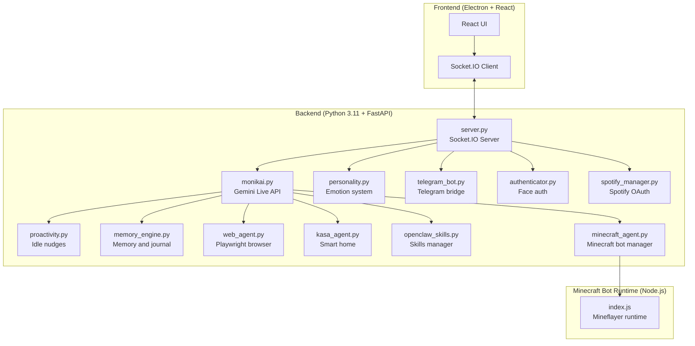

# MonikAI


MonikAI is a local-first AI companion for desktop use. It can talk in real time, remember things locally, see your screen and camera when enabled, and connect to tools like Telegram, Spotify, Minecraft, web browsing, and smart home devices.

## What It Does

| Area | What it does | Main tech |
|------|--------------|-----------|
| Voice conversation | Real-time voice chat with interruption handling and native audio output | Gemini Live API |
| Screen and camera understanding | Reads screen content, webcam frames, OCR text, and study-page captures | `mss`, OpenCV, PaddleOCR |
| Memory | Stores notes, journal pages, reminders, and structured memory across sessions | Local JSON and Markdown storage |
| Personality | Keeps mood, affection, energy, quests, unlocks, and tone state persistent | Stateful persona model |
| Proactivity | Runs conservative background thinking and nudges | Idle timers and heuristics |
| Telegram bridge | Supports text, images, voice notes, and memory helpers | Telegram Bot API |
| Web agent | Browses, clicks, searches, and completes longer web tasks | Playwright + Chromium |
| Spotify | Connects to Spotify and reads now playing, playlists, and recent listening | Spotify Web API |
| Smart home | Controls supported TP-Link Kasa devices | `python-kasa` |
| Face auth | Can stay locked until your face is recognized locally | MediaPipe Face Landmarker |
| Minecraft agent | Connects to your Minecraft server and performs in-game actions | Mineflayer bot runtime |

## Quick Start

```bash
git clone https://github.com/aerokero/monikai.git
cd monikai

conda create -n monikai python=3.11 -y
conda activate monikai
pip install -r requirements.txt
playwright install chromium

npm install
echo "GEMINI_API_KEY=your_key_here" > .env

npm run dev
```

### Experimental client–server mode

The desktop client can send microphone, camera, and screen frames to a
separate local backend. This is opt-in; without these variables the existing
local mode remains active:

```env
# backend .env
MONIKAI_SOCKET_TOKEN=use-a-long-random-local-token

# frontend build environment
VITE_MONIKAI_SERVER_URL=http://192.168.1.10:8000
VITE_MONIKAI_SOCKET_TOKEN=use-a-long-random-local-token
VITE_MONIKAI_CLIENT_CAPTURE=true
```

This mode is intended for a trusted LAN or VPN connection. It does not yet
provide TLS, multi-client session routing, or public Internet hardening.

### Always-on server microphone

When a microphone and speaker are connected to the server, MonikAI can use
them as a first-class conversation channel. Idle room audio is checked locally
with Vosk. After `Hey Monika`/`Hej Monika` (or just `Monika`) is recognized,
the utterance is transcribed and
sent through the same conversation, memory, and tool pipeline as web chat.
That includes Home Assistant, the shopping list, notes, and reminders. Each
wake activation creates a `Server Voice` conversation visible in web history.
While idle, the local Vosk recognizer can acknowledge a stable wake partial
immediately with a louder ping and a short, language-neutral `Hmmm?`; the
following command is closed by detected trailing silence rather than a fixed
utterance length.

The Docker Compose setup enables this channel by default. Relevant variables:

```env
SERVER_MIC_LISTENER_ENABLED=true
SERVER_MIC_WAKE_WORD_REQUIRED=true
SERVER_MIC_VOSK_MODEL_PATH=/app/data/vosk-model
SERVER_MIC_FOLLOWUP_TIMEOUT=8
SERVER_MIC_USE_GEMINI_LIVE=false
SERVER_MIC_TTS_PROVIDER=local
SERVER_MIC_TRAILING_SILENCE_MS=1200
SERVER_MIC_MAX_SPEECH_MS=15000
SERVER_MIC_STT_TIMEOUT_SECONDS=12
```

Put a compatible Polish Vosk model at `data/vosk-model`. Input and output
devices are auto-detected; fixed PortAudio indexes can be saved as
`server_mic_device_index` and `server_mic_output_index` in MonikAI settings.
The text reply uses the model and endpoint currently selected in the web model
picker (and follows changes made there); it never silently switches providers.
Server-speaker replies use local Kokoro with its experimental Polish G2P layer
and the `af_heart` female voice by default. If Kokoro cannot be loaded, the
renderer falls back to espeak-ng. Gemini TTS remains available as the natural,
cloud renderer option in Settings and receives an explicit `pl-PL` language
hint.
The optional Gemini Live compatibility mode has lower latency but a narrower
tool surface, so the normal conversation path is the default. Voice turns additionally request concise spoken replies while keeping
the selected text endpoint/model unchanged. If the selected endpoint returns
an authentication error, repair its key in Model Endpoints rather than
expecting the voice channel to choose a different provider.

## Project Layout

- `backend/core/` - runtime, socket handlers, lifecycle, and HTTP routers
- `backend/ai/` - memory, personality, quests, progression, and related systems
- `backend/agents/` - integrations for Telegram, Spotify, smart home, and web tasks
- `backend/integrations/games/minecraft-bot/` - the Node.js Minecraft bot runtime
- `backend/integrations/media/authenticator.py` - face authentication
- `backend/tools/openclaw_skills.py` - skills manager and tooling helpers
- `src/` - React UI
- `data/` - local settings, memory, profiles, sessions, quests, and recaps

## Setup And Docs

| What you want | Where to go |
|--------------|-------------|
| System setup and requirements | [Installation Guide](https://github.com/aerokero/monikai/wiki/Installation-Guide) |
| Environment variables | [Environment Variables](https://github.com/aerokero/monikai/wiki/Environment-Variables) |
| Face auth, permissions, proactivity | [Configuration](https://github.com/aerokero/monikai/wiki/Configuration) |
| Spotify, Minecraft, Telegram, smart home setup | [Feature Setup](https://github.com/aerokero/monikai/wiki/Feature-Setup) |
| Troubleshooting | [Troubleshooting Guide](https://github.com/aerokero/monikai/wiki/Troubleshooting) |
| Development notes | [Development Guide](https://github.com/aerokero/monikai/wiki/Development) |
| API reference | [API Reference](https://github.com/aerokero/monikai/wiki/API-Reference) |
| Contributing | [Contributing](https://github.com/aerokero/monikai/wiki/Contributing) |

## Architecture



## Privacy

Most user state lives locally in `data/` on your machine, including profile data, personality state, conversations, reminders, journal entries, and OAuth tokens. There is no custom cloud backend for memory or personality state.

## License

MIT. See [LICENSE](LICENSE).
