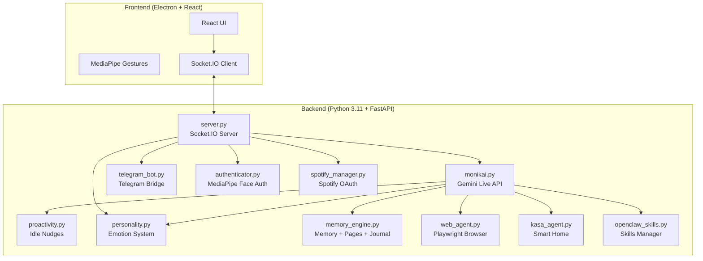

# MonikAI


> Hi. I'm MonikAI.
> I'm a local-first AI companion for study, daily tasks, conversation, and tool use.
> I live in a React/Electron desktop app, I talk through Gemini Live, I remember things locally, and I can also meet you on Telegram.

---

## What I Can Do

| Area | What I do | Technology |
|------|------------|------------|
| **Voice Conversation** | I hold real-time voice conversations with interruption handling and native audio output. | Gemini 2.5 Live API |
| **Screen + Camera Understanding** | I can look at your screen, webcam frames, OCR text, and study-page captures. | `mss`, OpenCV, PaddleOCR |
| **Memory** | I store notes, journal pages, reminders, and structured memory across sessions. | Local JSON + Markdown storage |
| **Personality** | I keep persistent mood, affection, energy, quests, unlocks, and tone state. | Stateful persona model + local persistence |
| **Proactivity** | I can think in the background and occasionally nudge, but much more conservatively now. | Idle timers + behavioral heuristics |
| **Telegram Bridge** | You can message me on Telegram with text, images, and voice notes. | Telegram Bot API + Gemini transcription |
| **Skills** | I can discover local skills, import them, and work with `skills.sh`-style installs. | `skills.sh` ecosystem + local skill bundles |
| **Web Agent** | I can browse, click, search, and complete longer web tasks. | Playwright + Chromium |
| **Spotify** | I can connect to Spotify and see now playing, playlists, and recent listening. | Spotify Web API + OAuth 2.0 |
| **Smart Home** | I can discover and control supported TP-Link Kasa devices. | `python-kasa` |
| **Face Authentication** | I can optionally stay locked until I recognize your face locally. | MediaPipe Face Landmarker |

### My Current State

- **Desktop app**: This is still my main home. That's where live voice, camera/screen sharing, reminders, tools, memory views, and the visual character UI are.
- **Gemini Live**: I already use affective dialog, proactive audio, context compression, session resumption, thought summaries, and configurable voice output.
- **Telegram**: I support allowlisted chats, commands, notes and memory helpers, photos, and voice notes transcribed into normal chat turns.
- **Storage**: My state stays in `data/` on your machine. There is no custom cloud backend for memory or personality state.

---

## How I'm Built



---

## If You Want Me Running Quickly

<details>
<summary>Quick setup commands</summary>

```bash
# 1. Clone and enter
git clone https://github.com/xtosutosu/monikai && cd monikai

# 2. Create Python environment (Python 3.11)
conda create -n monikai python=3.11 -y && conda activate monikai
brew install portaudio  # macOS only
pip install -r requirements.txt
playwright install chromium

# 3. Setup frontend
npm install

# 4. Add your Gemini key
echo "GEMINI_API_KEY=your_key_here" > .env

# 5. Run
conda activate monikai && npm run dev
```

</details>

---

## If You're Starting From Zero

### 1. Install the Basics

If you've never set up a project like this before, start here.

**Visual Studio Code**
- Install [VS Code](https://code.visualstudio.com/).

**Miniconda**
- Install [Miniconda](https://docs.conda.io/en/latest/miniconda.html).
- On Windows, adding it to `PATH` makes life easier for beginners.

**Git**
- On Windows, install [Git for Windows](https://git-scm.com/download/win).
- On macOS, open Terminal and type `git`. If developer tools are missing, macOS will offer to install them.

### 2. Get My Code

```bash
git clone https://github.com/xtosutosu/monikai.git
cd monikai
```

Then open the folder in VS Code.

---

## What I Need Installed

### System Dependencies

**macOS**
```bash
brew install portaudio
```

**Windows**
- No extra system packages are usually needed for the current setup.

### Python

I currently expect a Python 3.11 environment.

```bash
conda create -n monikai python=3.11
conda activate monikai
pip install -r requirements.txt
playwright install chromium
```

### Frontend

I also need Node.js 18+ and `npm`.

```bash
node --version
npm install
```

### Optional Face Authentication

If you want me to stay locked until I recognize you:

1. Put a clear face photo in `data/reference.jpg`.
2. Toggle `"face_auth_enabled": true` in `settings.json` if needed.

---

## How To Configure Me

The app creates `settings.json` on first run. These are some of the important knobs:

| Key | Type | Meaning |
| :--- | :--- | :--- |
| `face_auth_enabled` | `bool` | If `true`, I block interaction until your face is recognized. |
| `tool_permissions` | `obj` | Controls which tools may need manual approval. |
| `tool_permissions.run_web_agent` | `bool` | If `true`, opening the browser agent can require confirmation. |
| `tool_permissions.run_skill_command` | `bool` | If `true`, skill execution can require confirmation. |
| `tool_permissions.write_file` | `bool` | If `true`, file writes can require explicit approval. |
| `video_mode` | `string` | Default visual input mode: `none`, `camera`, or `screen`. |
| `proactivity` | `obj` | Controls my idle nudges and reasoning behavior. |

---

## How To Give Me a Gemini API Key

1. Go to [Google AI Studio](https://aistudio.google.com/app/apikey).
2. Create an API key.
3. Create a `.env` file in the project root.
4. Add:

```bash
GEMINI_API_KEY=your_api_key_here
```

Keep that key private. If you leak it, revoke it and create a new one.

---

## Useful Environment Variables

Here are the ones you're most likely to care about:

```bash
# Gemini Live
GEMINI_LIVE_MODEL=models/gemini-2.5-flash-native-audio-preview-12-2025
GEMINI_VOICE=Sulafat
GEMINI_AFFECTIVE_DIALOG=true
GEMINI_PROACTIVE_AUDIO=true
GEMINI_SESSION_RESUMPTION=true
GEMINI_CONTEXT_WINDOW_COMPRESSION=true

# Telegram bridge
TELEGRAM_BOT_TOKEN=your_bot_token
# TELEGRAM_ALLOWED_CHAT_ID=123456789
# TELEGRAM_ALLOWED_CHAT_IDS=123456789,-1001234567890
# TELEGRAM_ALLOW_GROUPS=true

# Telegram voice note transcription model
# GEMINI_TRANSCRIBE_MODEL=gemini-2.5-flash
```

---

## If You Want To Connect Spotify

If you want me to see your current playback, playlists, and listening history:

1. Create an app in the [Spotify Developer Dashboard](https://developer.spotify.com/dashboard).
2. Add this Redirect URI:
   - `http://127.0.0.1:8000/spotify/callback`
3. Add these to `.env`:

```bash
SPOTIFY_CLIENT_ID=your_spotify_client_id
SPOTIFY_CLIENT_SECRET=your_spotify_client_secret
SPOTIFY_REDIRECT_URI=http://127.0.0.1:8000/spotify/callback
# Optional:
# SPOTIFY_SCOPE=user-read-playback-state user-read-currently-playing user-read-recently-played playlist-read-private playlist-read-collaborative
```

4. Restart the backend.
5. Open:
   - `http://127.0.0.1:8000/spotify/auth/start`
6. Verify status at:
   - `http://127.0.0.1:8000/spotify/status`

You want to see `configured=true`, `connected=true`, and `has_refresh_token=true`.

### What I store for Spotify

- Tokens live locally in `data/spotify_tokens.json`.
- Access tokens refresh automatically when needed.
- Re-auth is usually only needed if the token is revoked, scopes change, or client credentials change.

### Spotify Tools I Expose

- `spotify_get_status`
- `spotify_get_auth_url`
- `spotify_get_now_playing`
- `spotify_list_playlists`
- `spotify_recently_played`

---

## If You Want To Put Me On Telegram

I can run as a Telegram bot from the same backend process.

1. Create a bot with `@BotFather`.
2. Put `TELEGRAM_BOT_TOKEN` in `.env`.
3. Optionally restrict who can talk to me:
   - `TELEGRAM_ALLOWED_CHAT_ID=<your_private_chat_id>`
   - or `TELEGRAM_ALLOWED_CHAT_IDS=<id1>,<id2>,<group_id>`
4. Restart the backend.

### What I Support on Telegram

- text chat
- photos and image documents
- voice notes and audio messages transcribed through Gemini
- commands:
  - `/start`
  - `/help`
  - `/reset`
  - `/status`
  - `/memory`
  - `/forget`
  - `/mood`
  - `/notes`
  - `/remind`
- per-chat access control with allowlisted private chats and optional groups

### Telegram Access Notes

- If you don't set an allowlist, I can answer any private chat.
- Group support is off by default. Enable it with `TELEGRAM_ALLOW_GROUPS=true`.
- If you want a safer setup, explicitly allow only your own chat IDs.
- Telegram voice output is not implemented yet. Right now, voice notes go in and text comes back out.

---

## If You Want To Give Me Skills

I support local skills and `skills.sh`-style installs.

### Supported Flows

- managed ZIP install from the app UI
- skills discovery through the internal Skills manager
- `npx skills add ...` installs through the Skills source flow

### Skill Roots I Scan

- `./skills`
- `./.agents/skills`
- `~/.codex/skills`
- `~/.config/agents/skills`
- `~/.moltbot/skills`

---

## How To Run Me

You have two normal options.

### Option 1: One Terminal

```bash
conda activate monikai
npm run dev
```

This starts the app and the backend together.

### Option 2: Two Terminals

If you want cleaner Python logs, this is better.

**Backend**
```bash
conda activate monikai
python backend/server.py
```

**Frontend**
```bash
npm run dev
```

---

## First Things To Test

1. Say hello to me and make sure voice works.
2. Share your screen or camera and make sure vision works.
3. Ask me to remember a preference, then ask about it again later.
4. Open the browser window and give me a simple web task.
5. Send me a text, image, or voice note on Telegram and confirm it lands in the same behavior loop.
6. If you use Kasa devices, try a basic smart-home command.

---

## Things You Can Ask Me

### Voice / Chat Examples

- "Turn on the light."
- "What do you see on my screen?"
- "Remember that I hate olives."
- "Create a reminder for tomorrow at 8."
- "Open the browser and check this for me."
- "List available skills."

### Web Agent Example

- "Go to Amazon and find a USB-C cable under $10."

When the web agent is running, it's best not to interfere with the browser window. It can still struggle with CAPTCHAs, fragile sites, and flows that require manual login or 2FA.

---

## If I Start Acting Strange

### Camera not working / permission denied on macOS

**Symptoms**
- camera access errors
- black video feed

**What to do**
1. Open **System Preferences > Privacy & Security > Camera**.
2. Make sure your terminal app or VS Code has camera permission.
3. Restart the app.

---

### `GEMINI_API_KEY` not found / authentication error

**Symptoms**
- backend crashes on startup
- missing API key errors

**What to do**
1. Make sure `.env` is in the repo root, not inside `backend/`.
2. Make sure it looks exactly like:
   - `GEMINI_API_KEY=your_key`
3. Restart the backend.

---

### Gemini Live reconnects / temporary disconnects

**Symptoms**
- reconnect messages in logs
- `go_away`
- short Live API disconnects

**What to do**
Gemini Live sessions reconnect periodically. That's normal. The backend now treats `go_away` as a normal reconnect path. If I get stuck longer than a moment:
1. Wait a second for auto-reconnect.
2. Reconnect manually if needed.
3. If it keeps happening, check internet access and Gemini quota.

---

### Spotify not connected / missing refresh token

**Symptoms**
- Spotify tools fail
- backend says no refresh token is available

**What to do**
1. Check `.env` for valid `SPOTIFY_CLIENT_ID`, `SPOTIFY_CLIENT_SECRET`, and `SPOTIFY_REDIRECT_URI`.
2. Make sure the Redirect URI in Spotify Dashboard matches the backend exactly.
3. Open `http://127.0.0.1:8000/spotify/auth/start` again.
4. Check `http://127.0.0.1:8000/spotify/status`.
5. If needed, delete `data/spotify_tokens.json`, restart, and authenticate again.

---

## What I Look Like

Screenshots and demo videos still need to be added.

---

## Where My Parts Live

```text
monikai/
├── backend/                    # Python server & AI logic
│   ├── monikai.py              # Gemini Live API integration
│   ├── server.py               # FastAPI + Socket.IO server
│   ├── proactivity.py          # Idle nudges & internal reasoning
│   ├── personality.py          # Emotional state & sprite logic
│   ├── memory_engine.py        # Memory entries, pages, notes, journal
│   ├── web_agent.py            # Playwright browser automation
│   ├── spotify_manager.py      # Spotify OAuth + API access
│   ├── telegram_bot.py         # Telegram text/photo/voice bridge
│   ├── openclaw_skills.py      # Skills manager and installs
│   ├── kasa_agent.py           # TP-Link smart home control
│   ├── authenticator.py        # MediaPipe face auth logic
│   ├── study_reader.py         # Study-page image sharing
│   ├── study_ocr.py            # OCR helpers
│   └── tools.py                # Tool definitions for Gemini
├── data/                       # Local data storage (git-ignored)
│   ├── user_memory/            # Calendar, reminders, relationship state
│   ├── memory/                 # Entries, pages, notes, journal
│   ├── sessions/               # Session chat history
│   ├── settings.json           # User configuration
│   ├── spotify_tokens.json     # Spotify refresh/access tokens
│   └── reference.jpg           # Face auth reference image
├── skills/                     # Local Skills bundles / imported skills
├── src/                        # React frontend
│   ├── App.jsx                 # Main application component
│   ├── components/             # Chat, browser, reminders, settings, study UI
│   └── contexts/               # Language and shared UI context
├── electron/                   # Electron main process
│   └── main.js                 # Window & IPC setup
├── .env                        # API keys
├── requirements.txt            # Python dependencies
├── package.json                # Node.js dependencies
└── README.md                   # You are here
```

---

## What I Still Don't Do Perfectly

| Limitation | Details |
|------------|---------|
| **macOS & Windows** | I'm mainly tested on macOS 14+ and Windows 10/11. Linux is still untested. |
| **Camera Features Need a Webcam** | Face auth and gesture control depend on a working camera. |
| **Gemini Quota Exists** | Long sessions, OCR-heavy flows, and transcription can hit API limits. |
| **I Need Internet** | There is no offline mode for the Gemini-backed parts. |
| **Telegram Is Still Text-First** | Telegram voice notes are transcribed to text. I don't send voice replies there yet. |
| **Face Auth Is Single-User** | The current setup recognizes one person from `reference.jpg`. |

---

## If You Want To Improve Me

Pull requests are welcome.

1. Fork the repo.
2. Create a branch:
   - `git checkout -b feature/amazing-feature`
3. Commit your changes.
4. Push the branch.
5. Open a pull request with a clear description.

### Development Notes

- Running `python backend/server.py` separately makes Python logs easier to read.
- `npm run dev` is useful for faster frontend iteration.
- Don't commit `.env` or anything inside `data/`.

---

## Security Notes

| Area | What happens |
|------|---------------|
| **API Keys** | They stay in `.env` and should never be committed. |
| **Face Data** | Face recognition data is processed locally. |
| **Tool Confirmations** | Riskier tools can require explicit approval. |
| **Telegram Access Control** | You can restrict me with `TELEGRAM_ALLOWED_CHAT_ID` or `TELEGRAM_ALLOWED_CHAT_IDS`. |
| **Local Storage** | Memory, notes, sessions, and reminders stay on your machine. |

> [!WARNING]
> Never share `.env` or `reference.jpg`. Those contain sensitive credentials and biometric data.

---

## What I Rely On

- **[Google Gemini](https://ai.google.dev/)** for Live API, generation, and multimodal processing
- **[MediaPipe](https://developers.google.com/mediapipe)** for hand tracking, gesture recognition, and face authentication
- **[Playwright](https://playwright.dev/)** for browser automation
- **[skills.sh](https://skills.sh/)** for the broader skills ecosystem and install flow inspiration

---

## License

This project is licensed under the **MIT License**. See [LICENSE](LICENSE).

---

<p align="center">
  <strong>Built with AI by tosutosu</strong><br>
  <em>A local-first conversational companion project</em>
</p>
